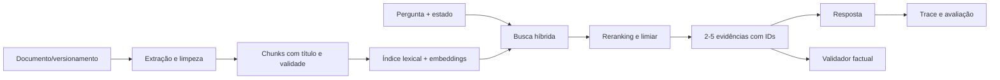
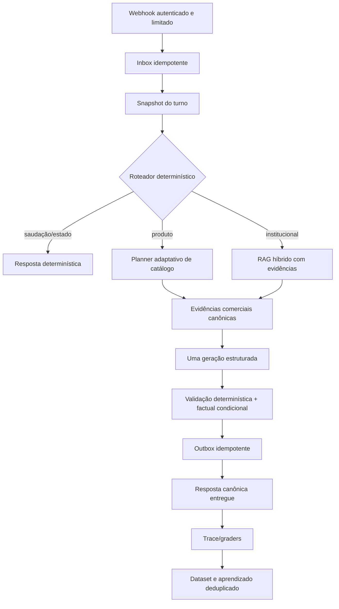

# Auditoria profunda do agente comercial e do RAG v100

## Parecer executivo

O agente está operacional em produção, a versão publicada corresponde ao `main` auditado e a base de testes é ampla. Ainda assim, ele não está no ponto de melhor desempenho possível. O risco principal deixou de ser uma falha isolada de resposta e passou a ser a complexidade da própria execução: uma solicitação simples pode disparar muitos acessos ao catálogo, banco e modelo, enquanto um prompt de aproximadamente 14 mil tokens mistura persona, políticas, memória, conhecimento e contratos parcialmente repetidos. Isso eleva latência e custo e aumenta a chance de uma instrução importante se perder no contexto.

Há dois achados de maior prioridade. Primeiro, o processo de aprendizado lê todas as linhas de respostas, inclusive tentativas não entregues e duplicatas criadas pela recuperação do outbox. Com isso, o sistema pode aprender ou medir uma resposta que o cliente nunca recebeu e dar peso duplicado à mesma interação. Segundo, as dependências implantadas incluem versões de `Starlette` e `python-dotenv` com avisos de segurança publicados e correções disponíveis. A exposição varia conforme o caminho, mas a atualização controlada não deve ser adiada.

O componente chamado de RAG precisa ser separado em três sistemas com requisitos distintos:

1. **Catálogo comercial:** possui busca lexical, filtros, índice PostgreSQL, revalidação na Tray e sinais visuais. É a parte mais madura, porém consulta demais e não encerra a busca quando já há evidência suficiente.
2. **Conhecimento institucional:** hoje não é RAG semântico. Usa correspondência de palavras e injeta anexos inteiros ou itens administrativos sem ranqueamento por relevância, chunking ou rastreabilidade por evidência.
3. **Memória da conversa/contato:** guarda estado estruturado e resumo, abordagem adequada para preferências e continuidade. O problema atual é o custo de composição e a multiplicação de leituras por turno.

Minha avaliação geral é **6,8/10**: boa cobertura funcional e guardrails acima da média, mas eficiência, aprendizado confiável, recuperação institucional e testes dos caminhos assíncronos ainda limitam a qualidade real. A prioridade não é adicionar mais agentes julgadores. É reduzir o caminho crítico, tornar a recuperação adaptativa, limitar o contexto e transformar conversas reais entregues em avaliações reproduzíveis.

## Escopo, método e limites

A auditoria examinou o commit `7cb761f` (`fix: honor explicit product refinements and photo requests`), correspondente ao SHA exposto pela saúde pública de produção (`7cb761fe26e4`) e à versão `openai-db-context-multichannel-runtime-v100`. Foram revisados os módulos sob `app/` e `api/`, arquivos de configuração, workflows, testes, relatórios anteriores, o PDF **Auditoria_Chatbo_2026-09-07.pdf**, esquema e dados operacionais de produção em modo somente leitura, logs fornecidos pelo usuário e a conversa recente autorizada para análise. O documento anterior foi tratado como evidência histórica, não como instrução.

Foram executados:

- compilação de todo o Python em `app/` e `api/`;
- suíte completa com cobertura de linhas e branches;
- conjunto marcado como avaliação offline;
- análise estática de segurança com Bandit;
- auditoria de dependências com `pip-audit`;
- inspeção read-only de mensagens, respostas, outbox, prompts compilados, memória e cursor de aprendizado;
- três consultas à saúde pública do Vercel;
- comparação com documentação e projetos oficiais/de código aberto.

A inspeção local contou **255 arquivos Python**, **80.289 linhas**, **2.033 funções**, **178 classes** e **359 capturas amplas de exceção**. O volume impede que “linha por linha” signifique afirmar manualmente a correção semântica de cada uma das 80 mil linhas; foi feita varredura integral automatizada e leitura detalhada dos módulos críticos, dos maiores módulos e dos caminhos exercidos pela conversa real.

Não houve acesso autenticado ao painel do Vercel, ao painel do Render ou ao GitHub Actions nesta execução: `gh`, Vercel CLI e Render CLI não estavam disponíveis, e nenhum token administrativo local estava configurado. Portanto, o parecer cruza os logs exportados pelo usuário, a saúde pública, a telemetria persistida e o estado do banco. Ele não afirma ter lido logs privados que não estavam acessíveis.

## Situação observada em produção

As três sondagens públicas retornaram `ok=true`, v100 e o mesmo SHA implantado. A latência do endpoint de saúde foi 1.189 ms na primeira chamada e 289/155 ms nas seguintes, comportamento compatível com aquecimento inicial. Existe **um aviso de configuração**, mas o endpoint público informa apenas a contagem; seu conteúdo requer `/api/admin/health` autenticado.

Na última conversa auditada, dez mensagens de entrada consumiram, somadas:

| Métrica | Valor |
|---|---:|
| chamadas lógicas ao modelo | 16 |
| tentativas de transporte OpenAI | 28 |
| fallbacks para Chat Completions | 12 |
| chamadas ao Tray Adaptor | 46 |
| chamadas ao banco | 546 |
| tokens de entrada OpenAI | 165.596 |
| tokens de saída OpenAI | 17.087 |
| tokens em cache informados | 33.792 |
| tokens de raciocínio | 8.592 |
| tempo médio de processamento | 16,4 s |
| pior tempo de processamento | 32,3 s |

Mesmo a saudação, respondida sem LLM ou Tray, realizou 39 operações de banco e levou 2,44 s. Os três turnos mais pesados fizeram de 13 a 16 chamadas Tray e entre 67 e 69 operações de banco. Um deles precisou de sete tentativas de transporte, cinco fallbacks e terminou com `llm_budget_exceeded` e `factual_validation_failed`.

Esses números explicam a sensação de que o agente “se perde” após uma resposta inicialmente correta. Cada refinamento pode reabrir busca, interpretação e verificação em vez de operar sobre um estado comercial pequeno e explícito, como `produto_em_foco`, `faixa`, `marcas_já_mostradas`, `marcas_pedidas`, `candidatos_confirmados` e `foto_solicitada`.

A conversa analisada ocorreu antes da validação pós-deploy das correções mais recentes. O código v100 corrige refinamento explícito e pedido de foto, mas ainda não havia tráfego WhatsApp posterior suficiente para comprovar o resultado em produção. Teste unitário aprovado não substitui esse canário.

## Achados priorizados

| ID | Severidade | Achado | Efeito provável |
|---|---|---|---|
| DR-01 | Crítica | aprendizado inclui respostas não entregues e duplicadas | otimização em direção a exemplos falsos e métricas enviesadas |
| DR-02 | Alta | contexto sistemático com cerca de 54 mil caracteres e sobreposição semântica | perda de instrução, custo, latência e comportamento inconsistente |
| DR-03 | Alta | busca de catálogo abre muitos probes em paralelo e novas páginas sem parada antecipada | 13–16 consultas Tray em turnos simples, risco de timeout/429 |
| DR-04 | Alta | dependências web com avisos de segurança corrigidos em versões posteriores | exposição a parsing/URL/DoS conforme o endpoint |
| DR-05 | Alta | caminhos de outbox, cron e remarketing têm cobertura muito baixa | regressão no exato fluxo que já produziu envios tardios |
| DR-06 | Alta | conhecimento institucional não possui recuperação semântica nem evidência rastreável | respostas erradas por ausência de palavra exata ou excesso de contexto |
| DR-07 | Média-alta | 546 acessos ao banco em dez turnos | latência, custo e maior superfície de falha |
| DR-08 | Média-alta | múltiplos validadores e corretores competem pelo orçamento do LLM | respostas simples podem terminar bloqueadas ou genéricas |
| DR-09 | Média | telemetria é rica, mas não fecha um ciclo de avaliação online por conversa entregue | falhas são detectadas manualmente e reaparecem |
| DR-10 | Média | leitura de corpo/formulário sem limite explícito na aplicação | consumo desnecessário de memória/CPU por payload grande |
| DR-11 | Média | módulos centrais grandes e muitas exceções amplas | manutenção difícil e falhas silenciosas |
| DR-12 | Média | não há prova automatizada de diversidade de marca em catálogo real | três itens válidos podem continuar concentrados em uma marca |

## DR-01 — o aprendizado não representa o que o cliente recebeu

`app/learning/cursor.py:65-132` percorre `ai_agent_responses` por ID ou data. A consulta não exige `provider_send_ok = true`, não elimina linhas sem `inbound_id` e não escolhe uma única resposta efetiva por mensagem recebida.

Na produção, as entradas 742–746 possuem linhas repetidas em `ai_agent_responses`: uma tentativa inicial marcada como não enviada e outra criada horas depois pela recuperação do outbox, marcada como enviada. A entrada 742 possui duas falhas antes do sucesso. Já o carregador de histórico da conversa usa uma seleção lateral da resposta enviada mais recente, então o contexto atual está protegido. O coletor de aprendizado, porém, lê cada tentativa.

Isso viola o contrato básico do aprendizado: o exemplo de treino/avaliação deve ser a experiência entregue. A correção deve:

1. selecionar apenas respostas entregues (`provider_send_ok IS TRUE`);
2. exigir uma mensagem de entrada válida;
3. escolher uma resposta canônica por `inbound_id`, preferindo a entrega final;
4. registrar separadamente tentativas de transporte para avaliação de confiabilidade;
5. impedir avanço do cursor se a página não puder ser normalizada;
6. recalcular ou marcar como contaminada a janela já lida até o cursor 746.

Critério de aceite: um fixture com duas falhas e um sucesso para o mesmo `inbound_id` deve gerar exatamente um atendimento aprendível, contendo o texto efetivamente entregue.

## DR-02 — o prompt é grande demais e contém contratos semanticamente repetidos

Os seis prompts compilados mais recentes mediram de 54.069 a 54.776 caracteres de instrução, aproximadamente 14,0–14,3 mil tokens antes da resposta e das ferramentas. A persona ativa sozinha tem 24.335 caracteres; um anexo processado acrescenta 8.476 caracteres; o contrato operacional do respondente acrescenta cerca de 11 mil caracteres, além de políticas de memória, tempo, canal, segurança e casos aprendidos.

`app/llm/prompt_compiler.py:320-372` concatena as camadas. `_is_redundant_contract_block`, em `app/llm/prompt_compiler.py:589-610`, remove apenas cópias quase idênticas após normalização. Ele não detecta que dois textos diferentes podem repetir ou contradizer a mesma regra. Portanto, uma persona extensa e o contrato comercial continuam juntos.

Contexto longo não garante uso uniforme da informação. O estudo *Lost in the Middle* encontrou degradação relevante quando a evidência necessária fica no meio de entradas longas.[^1] Aqui, a relação é uma inferência sustentada pelos prompts medidos: regras de refinamento e continuidade competem com dezenas de milhares de caracteres que não são necessários em todo turno.

Recomenda-se um compilador orientado por intenção:

- **núcleo fixo:** identidade curta, segurança e contratos invariantes;
- **estado do turno:** intenção, entidade em foco, restrições e último resultado;
- **política específica:** somente o bloco de compra, produto, suporte ou institucional aplicável;
- **evidência recuperada:** poucos trechos, cada um com ID, origem, versão e score;
- **histórico:** últimos turnos úteis mais resumo estruturado;
- **orçamento:** limite por bloco e limite total medido em tokens, com telemetria de truncamento.

Meta inicial: reduzir o prompt sistemático mediano em pelo menos 50% sem perda no conjunto de avaliação; para saudações e respostas determinísticas, zero chamada LLM; para refinamento de produto, uma chamada de geração e no máximo uma de correção condicionada a falha concreta.

## DR-03 — o catálogo faz busca especulativa demais

`app/catalog/retrieval/probes.py:111-132` executa todos os probes com `asyncio.gather`. `app/catalog/retrieval/harvest.py:77-108` pode lançar mais seis buscas de família em paralelo e depois percorrer até quatro cores por três páginas. A concorrência reduz o tempo de uma rodada, mas toda consulta já foi disparada antes de se saber se o primeiro resultado era definitivo.

Na conversa real, isso produziu 16 chamadas Tray num turno e 13 em outros dois. Esse fan-out é incompatível com uma interação simples e aumenta a chance de limite de taxa, timeout e divergência entre resultados obtidos em instantes diferentes.

Plano de consulta recomendado:

1. buscar referência/SKU exata no índice local;
2. revalidar somente os candidatos exatos na Tray;
3. se não houver confiança suficiente, executar uma busca composta por marca, modelo, cor e faixa;
4. abrir probes alternativos de forma adaptativa, em lotes pequenos;
5. parar ao atingir cobertura suficiente: três itens válidos e, quando solicitado, três marcas distintas;
6. aplicar `Semaphore`, deadline absoluto do turno e orçamento de chamadas por intenção;
7. registrar `query_plan`, motivo de cada expansão e `early_stop_reason`.

Orçamentos sugeridos para começar e ajustar com dados: até 4 chamadas em referência/refinamento, até 6 em descoberta aberta e até 8 apenas em fallback explícito. Quando não houver variedade suficiente em estoque, o agente deve dizer quantas marcas elegíveis encontrou e oferecer ampliar um único critério.

## DR-04 — atualização de dependências de segurança

O ambiente resolvido usa `fastapi 0.115.6`, `starlette 0.41.3` e `python-dotenv 1.0.1`. O `pip-audit` encontrou dez registros em dois pacotes. Após revisar aplicabilidade, os itens mais relevantes são:

- `python-dotenv <1.2.2`: sobrescrita local via symlink nas funções `set_key`/`unset_key`; o projeto não chama essas funções, reduzindo a exposição, mas a versão corrigida existe.[^2]
- Starlette: avisos de reconstrução de URL a partir de autoridade/caminho e limites de formulário urlencoded; o projeto usa `request.url.path`, `request.url.query` e `request.form()`, portanto parte da superfície existe.[^3]
- Starlette: avisos de `FileResponse`, `StaticFiles` no Windows e `HTTPEndpoint` foram encontrados pelo scanner, mas essas APIs não aparecem no código auditado. Não devem ser tratados como exploração confirmada.

Recomenda-se atualizar primeiro `python-dotenv` para 1.2.2 e testar. Para Starlette, fazer upgrade controlado de FastAPI para uma versão que aceite uma Starlette corrigida, com testes de contrato dos webhooks Brevo/Meta, formulários, assinatura, proxy/host e limites de corpo. Não se deve forçar uma versão transiente incompatível apenas para silenciar o scanner.

O Bandit reportou 37 ocorrências: nenhuma alta, 20 médias e 17 baixas. A maioria dos alertas de SQL (`B608`) ocorre em composição de fragmentos internos com parâmetros separados e não foi confirmada como injeção. Permanecem úteis como lista de revisão sempre que nomes de coluna ou cláusulas passarem a aceitar entrada externa.

## DR-05 — testes fortes no total, fracos nos caminhos de maior risco operacional

A suíte completa terminou com **1.909 aprovados, 1 ignorado**, em 61,11 s. A avaliação offline terminou com **101 aprovados**. A cobertura agregada foi **72,78%** considerando branches e **75,76%** para statements; branches isoladamente ficaram em **65,34%**.

O total mascara lacunas relevantes:

| Módulo | Cobertura |
|---|---:|
| `app/ingress/outbox_worker.py` | 8,75% |
| `app/http/cron.py` | 31,85% |
| `app/learning/remarketing.py` | 37,85% |
| `app/identity/repository.py` | 30,43% |
| `app/ingress/inbox.py` | 43,75% |
| `app/ingress/outbox.py` | 45,70% |
| `app/core/db.py` | 53,78% |
| `app/learning/reflect.py` | 29,85% |
| `app/tray/tray_sync.py` | 0% |
| `app/stories/story_media_retention.py` | 0% |

Outbox, remarketing e cron estão exatamente no caminho dos envios tardios observados. Os testes prioritários devem reproduzir: concorrência de workers, lease expirado, recuperação após falha do provedor, idempotência por mensagem, remarketing com resposta recente, ordem cron/entrada e garantia de que uma recuperação atualiza a entrega sem criar um novo exemplo de aprendizado.

O workflow de CI exige 70% agregado e roda avaliações offline, mas ainda não promove conversas reais anonimizadas a um conjunto bloqueante. A documentação oficial da OpenAI recomenda começar por traces para diagnosticar tool calls e guardrails e depois transformar o comportamento desejado em datasets e execuções repetíveis.[^4]

## DR-06 — conhecimento institucional ainda é seleção por palavras, não RAG

O próprio código documenta em `app/persona/store_knowledge.py:117-129` que usa snippets por pistas, sem RAG vetorial. A função testa se qualquer substring de uma lista ocorre na mensagem. Em seguida, `app/persona/store_knowledge.py:132-178` acrescenta todos os itens institucionais definidos na persona, sem filtrar sua relevância.

`app/persona/persona_knowledge_repository.py:69-104` carrega até dez anexos completos, em ordem de criação. Não há chunking, embeddings, busca híbrida, reranking, limiar de score, validade temporal ou citação da fonte usada. A API de Retrieval da OpenAI descreve busca semântica sobre vector stores para recuperar trechos semelhantes mesmo sem coincidência literal.[^5] Haystack também separa indexação, divisão de documentos, retrieval e avaliação em componentes explícitos; esse padrão é útil mesmo sem adotar o framework.[^6]

Arquitetura proposta para conhecimento institucional:

Cada evidência deve carregar `source_id`, `chunk_id`, `version`, `effective_at`, `score` e texto. Se nenhuma evidência ultrapassar o limiar, o agente deve responder com conhecimento seguro já codificado ou pedir o dado necessário, sem transformar ausência de recuperação em fato negativo.

## DR-07 — número excessivo de leituras de banco

Dez turnos fizeram 546 operações. A saudação fez 39. O problema não é apenas desempenho do PostgreSQL: cada consulta introduz nova possibilidade de estado inconsistente dentro do mesmo turno.

Criar um `TurnContext` carregado uma vez por mensagem com:

- tenant, canal e identidade;
- persona ativa e versão;
- preferências/memórias relevantes;
- resumo e janela de histórico;
- estado comercial e configuração efetiva;
- budgets e trace ID.

Repositórios continuam responsáveis por persistência, mas os consumidores leem esse snapshot durante o turno. Escritas podem ser reunidas em fases explícitas. Métricas devem separar queries, conexões e tempo total de banco. Meta inicial: reduzir a mediana para menos de 20 operações em turnos comuns e menos de 35 em descoberta complexa.

## DR-08 — guardrails demais no caminho crítico

O projeto possui interpretação, conselho de resposta, validação factual, crítica, double-check, regras de compra e fallbacks de transporte. Guardrails são necessários, mas a conversa real mostra duas chamadas lógicas por muitos turnos e até cinco fallbacks de transporte, com bloqueio final mesmo após busca cara.

A prática recomendada é manter guardrails em camadas e rastrear o que cada um bloqueou.[^7] A simplificação indicada é:

- validações determinísticas antes do LLM para preço, estoque, URL, referência e identidade;
- uma geração principal com saída estruturada;
- um único validador factual acionado apenas se houver afirmações comerciais verificáveis;
- reparo local baseado nos campos inválidos, sem recompor toda a busca;
- handoff/fallback quando o limite de correções for atingido.

O orçamento deve considerar chamadas lógicas e tentativas de transporte separadamente. Fallback de API é confiabilidade de infraestrutura e não pode consumir silenciosamente o orçamento de raciocínio nem repetir ferramentas já concluídas.

## DR-09 — observabilidade existe, mas falta avaliação fechada

A telemetria persistida é uma qualidade do projeto: há trace ID, contagem de LLM/Tray/banco, tokens, estágios, motivos de fallback, validação e dados de saída. O OpenAI Agents SDK usa exatamente a ideia de trace ponta a ponta com spans de geração, ferramentas e guardrails.[^8] LangGraph mostra outro padrão relevante: checkpoints por etapa e estado de thread permitem recuperar falhas sem repetir nós concluídos.[^9]

Não é necessário migrar para esses frameworks. O projeto deve adotar os contratos:

- um trace canônico por mensagem;
- spans pai/filho para interpretar, recuperar, gerar, validar e enviar;
- estado de cada etapa persistido e idempotente;
- ligação entre `inbound_id`, resposta canônica entregue, outbox e avaliação;
- replay offline sem chamar provedor real;
- graders para ferramenta correta, preservação de contexto, diversidade, factualidade e qualidade da resposta;
- comparação por versão de prompt, modelo, índice e código.

O cursor de aprendizado informa 34 linhas varridas e nenhum caso criado. Isso pode significar ausência de sinal ou filtros muito restritivos; hoje não há evidência de que o mecanismo esteja melhorando a produção. Ele deve publicar taxa de elegibilidade, motivos de rejeição e qualidade posterior dos casos aceitos.

## DR-10 — limite explícito de payload

`app/http/payload.py:43-75` chama `request.body()` e, em alguns tipos, `request.form()`. `app/http/meta_webhook.py:62-78` lê todo o corpo antes de verificar a assinatura. Limites da plataforma ajudam, mas a aplicação deve rejeitar `Content-Length` acima do contrato e interromper a leitura em streaming quando exceder o máximo. Definir limites distintos para JSON e mídia/formulário e retornar 413. A assinatura Meta continua sendo validada sobre os bytes originais aceitos.

## DR-11 — complexidade estrutural e exceções amplas

Os maiores módulos têm entre 1.092 e 2.040 linhas: carrinho, gateway OpenAI, banco, stories, agente de vendas, matcher visual, pedidos, configuração e validadores. Há 359 `except Exception` ou equivalentes amplos. Alguns são limites legítimos de integração, mas vários apenas imprimem e continuam; em `app/http/payload.py:74-75`, por exemplo, qualquer falha de formulário é descartada antes de um erro genérico.

A decomposição deve seguir responsabilidades observáveis, não apenas tamanho:

- gateway: preparação, transporte, retry/fallback, parsing e métricas;
- agente de vendas: estado do turno, roteamento de intenção, catálogo e geração;
- banco: conexão/transação, repositórios por agregado e migrações;
- carrinho/pedido: regras puras, integração Tray e persistência.

Toda captura ampla deve resultar em uma destas decisões explícitas: traduzir erro de integração, fazer fallback conhecido, abortar o turno ou registrar e relançar. `pass` silencioso deve ser reservado a parsing opcional com métrica própria.

## DR-12 — diversidade precisa ser propriedade testável

O limite visível de três sugestões é razoável para WhatsApp, mas diversidade não emerge apenas aumentando o pool. Ela precisa fazer parte da consulta e do ranking. Para “uma de cada marca”, o contrato deve ser:

1. preservar faixa, categoria, disponibilidade e refinamentos do usuário;
2. agrupar candidatos elegíveis por marca normalizada;
3. escolher a melhor opção de cada marca;
4. selecionar até três marcas, penalizando repetição de família/modelo;
5. revalidar preço/estoque somente dos finalistas;
6. explicar quando há menos marcas elegíveis.

O backtest deve incluir cenários com três marcas disponíveis, uma só marca, marca escrita com variação, cor/refinamento após lista inicial, produto já encontrado e pedido de “outras marcas”. A avaliação deve conferir produtos retornados, diversidade, preservação de faixa e linguagem final.

## O que já está funcionando

- deploy v100 alinhado ao commit auditado;
- saúde pública estável nas sondagens;
- webhook Brevo rejeita token ausente antes de executar agente, explicando corretamente o 401 fornecido;
- histórico de conversa escolhe a resposta entregue mais recente e evita usar tentativas falhas duplicadas;
- outbox não tinha itens pendentes, mortos ou falhos no instante da consulta;
- suíte ampla e rápida, com avaliações offline no CI;
- catálogo combina índice local, filtros duros e revalidação ao vivo;
- telemetria registra custo, integrações, caminhos de fallback e tempo por estágio;
- respostas triviais podem evitar LLM;
- correções de contexto explícito e envio de foto estão presentes no SHA publicado.

## Arquitetura-alvo

O princípio central é que recuperação produz evidência, geração transforma evidência em linguagem e entrega define qual resposta pode entrar no aprendizado. Cada fronteira deve ter um contrato pequeno e testável.

## Plano de execução recomendado

### Fase 0 — correção de integridade e segurança (1–2 dias)

1. Corrigir a consulta do aprendizado e adicionar migração/reprocessamento controlado da janela contaminada.
2. Atualizar `python-dotenv`; planejar e testar o upgrade FastAPI/Starlette.
3. Adicionar limite explícito de corpo e formulário.
4. Expor, de forma autenticada, o texto do único aviso de configuração e resolvê-lo.
5. Criar teste de idempotência que una inbox, resposta, outbox e aprendizado.

### Fase 1 — custo, latência e contexto (3–5 dias)

1. Introduzir `TurnContext` e cache por turno.
2. Instrumentar tokens por camada do prompt.
3. Aplicar orçamento total e compilação por intenção.
4. Criar planner adaptativo do catálogo com parada antecipada e limites por intenção.
5. Consolidar validação em uma chamada condicional.

### Fase 2 — RAG institucional real (4–7 dias)

1. Versionar e dividir anexos em chunks.
2. Implementar busca híbrida lexical + embeddings.
3. Reranquear, aplicar limiar e enviar somente 2–5 evidências.
4. Persistir evidências no trace e validá-las na saída.
5. Criar dataset de perguntas institucionais com respostas e fontes esperadas.

### Fase 3 — avaliação contínua e canário (3–5 dias)

1. Anonimizar conversas entregues e promover falhas reais a fixtures.
2. Avaliar contexto, catálogo, diversidade, factualidade, mídia, compra e remarketing.
3. Bloquear merge por regressão nos cenários críticos, não só por cobertura total.
4. Fazer canário pós-deploy pelo WhatsApp e comparar trace com baseline.
5. Monitorar P50/P95, custo por conversa, chamadas Tray/DB e taxa de reparo.

## Metas mensuráveis

| Indicador | Baseline observado | Meta inicial |
|---|---:|---:|
| processamento P95 por turno | até 32,3 s na amostra | < 10 s descoberta; < 5 s demais |
| Tray por refinamento/referência | até 16 | P95 ≤ 4 |
| Tray por descoberta aberta | até 16 | P95 ≤ 6 |
| banco por turno | média 54,6 | P50 < 20; P95 < 35 |
| instruções compiladas | ~14 mil tokens | mediana < 7 mil |
| resposta aprendível por inbound | pode ser >1 | exatamente 1 entregue |
| cobertura outbox worker | 8,75% | ≥ 80% de branches críticos |
| cobertura remarketing | 37,85% | ≥ 80% de branches críticos |
| diversidade quando há 3 marcas elegíveis | sem prova online | ≥ 95% dos casos |
| canário v100 pós-deploy | não comprovado | 100% dos cenários críticos |

## Matriz mínima de backtest

O conjunto deve usar snapshots de catálogo e respostas mockadas da Tray para permanecer determinístico:

- orçamento exato, faixa informal e moeda com pontuação;
- “outras marcas”, “uma de cada marca” e “mais opções nessa faixa”;
- cor após produto encontrado, com preservação de referência/família;
- pedido de foto após lista e após produto único;
- falta de estoque durante revalidação;
- tentativa Tray 401/429/timeout e circuit breaker;
- novo inbound enquanto remarketing está enfileirado;
- outbox falha, lease expira e recuperação envia uma única vez;
- mensagem duplicada do provedor;
- resposta não entregue nunca entra no aprendizado;
- perguntas institucionais por paráfrase sem palavra exata;
- conflito entre documento antigo e versão vigente;
- prompt injection em anexo e em mensagem do cliente;
- alternância WhatsApp/Instagram para o mesmo contato;
- retomada após horas sem confundir item antigo com o atual.

Cada caso deve guardar entrada, estado inicial, ferramentas esperadas, limites de chamadas, evidências esperadas, propriedades da resposta e estado final. Comparar texto exato é frágil; usar asserts determinísticos e graders apenas para critérios linguísticos.

## Comparação com agentes e metodologias públicas

| Referência | Prática validada/publicada | Aplicação neste projeto |
|---|---|---|
| OpenAI Agents SDK | sessões, guardrails e trace de chamadas/ferramentas | formalizar snapshot de turno e trace canônico, sem exigir migração de framework |
| OpenAI Agent Evals | traces primeiro; depois datasets e eval runs repetíveis | converter conversas entregues em regressões e comparar versões |
| LangGraph | estado explícito e checkpoints por etapa | recuperar envio/execução sem repetir busca ou geração concluída |
| Haystack | pipeline separado de indexação, retrieval e avaliação | substituir anexos inteiros por chunks ranqueados com evidência |
| Lost in the Middle | contexto maior pode piorar uso da evidência conforme posição | reduzir e ordenar contexto por relevância e intenção |

Frameworks de código aberto são referências arquiteturais, não prova automática de qualidade. Migrar para um deles agora adicionaria risco e não corrigiria os contratos de dados. O melhor retorno vem de aplicar os padrões no código existente e medir a mudança.

## Decisão recomendada

O produto pode continuar operando, mas o aprendizado automático deve ser considerado **não confiável para promoção autônoma** até a correção de DR-01. O caminho de vendas pode permanecer ativo com monitoramento, pois não foram encontrados itens presos no outbox e a saúde pública está correta. A próxima rodada de implementação deve começar por integridade de aprendizado, dependências e testes de outbox/remarketing; depois reduzir prompt, banco e chamadas Tray. O RAG institucional deve ser construído como uma etapa própria, sem misturá-lo ao aumento da persona.

Após essas mudanças, a reavaliação precisa usar novas conversas reais da versão implantada e comparar os mesmos indicadores. A aprovação deve depender do comportamento ponta a ponta no WhatsApp, inclusive “outras marcas”, refinamento, foto e interrupção de remarketing, e não apenas do número de testes aprovados.

## Fontes

[^1]: Nelson F. Liu et al., “Lost in the Middle: How Language Models Use Long Contexts”, *Transactions of the Association for Computational Linguistics*, 2024. https://arxiv.org/abs/2307.03172
[^2]: GitHub Advisory Database, “python-dotenv: Symlink following in set_key allows arbitrary file overwrite”, GHSA-mf9w-mj56-hr94. https://github.com/advisories/GHSA-mf9w-mj56-hr94
[^3]: GitHub Advisory Database, avisos Starlette GHSA-86qp-5c8j-p5mr, GHSA-jp82-jpqv-5vv3 e GHSA-82w8-qh3p-5jfq. https://github.com/advisories/GHSA-86qp-5c8j-p5mr ; https://github.com/advisories/GHSA-jp82-jpqv-5vv3 ; https://github.com/advisories/GHSA-82w8-qh3p-5jfq
[^4]: OpenAI, “Evaluate agent workflows”. https://developers.openai.com/api/docs/guides/agent-evals
[^5]: OpenAI, “Retrieval”. https://developers.openai.com/api/docs/guides/retrieval
[^6]: deepset, Haystack documentation and source repository. https://docs.haystack.deepset.ai/docs/retrievers ; https://github.com/deepset-ai/haystack
[^7]: OpenAI, “A practical guide to building AI agents”. https://openai.com/business/guides-and-resources/a-practical-guide-to-building-ai-agents/
[^8]: OpenAI Agents SDK, “Tracing” and “Sessions”. https://openai.github.io/openai-agents-python/tracing/ ; https://openai.github.io/openai-agents-python/sessions/
[^9]: LangChain, LangGraph checkpointer documentation and source. https://github.com/langchain-ai/docs/blob/main/src/oss/langgraph/checkpointers.mdx ; https://github.com/langchain-ai/langgraph

### Evidências internas principais

- `app/learning/cursor.py:65-132`
- `app/llm/prompt_compiler.py:300-372,585-610`
- `app/persona/persona_knowledge_repository.py:69-104`
- `app/persona/store_knowledge.py:117-178`
- `app/catalog/retrieval/probes.py:111-145`
- `app/catalog/retrieval/harvest.py:55-110`
- `app/http/payload.py:43-80`
- `app/http/meta_webhook.py:62-78`
- `.github/workflows/ci.yml`
- `.github/workflows/attendance-learning.yml`
- `docs/audits/2026-09-08/AUDITORIA-INTEGRADA-POS-DEPLOY-V100.md`
- `docs/audits/2026-09-08/IMPLEMENTACAO-MELHORIAS.md`
