# Análise completa — consultas, respostas, persona e confiabilidade

**Projeto:** NSAgentForSorteios / NewStoreAgent
**Data:** 15/09/2026, horário de Brasília
**Código analisado:** `3e73949bf93c0d46a983f19ff8af150660c23c8f`
**Deploy verificado:** produção, `READY`, mesmo SHA, publicado às 00:41 de 15/09.
**Banco consultado:** projeto Supabase `NsAgent`; leituras iniciadas aproximadamente às 01:56 de 15/09.

A inconsistência da persona ativa foi reconfirmada às 02:11 de 15/09.

## 1. Conclusão executiva

O projeto tem uma boa base funcional: interpretação estruturada, filtros determinísticos, verificação de produtos reais, memória, proteção de pagamentos e entrega durável. O maior ganho está em **corrigir a publicação da persona, alinhar as políticas comerciais, reduzir consultas e tentativas repetidas e avaliar a resposta final entregue**.

Há dois problemas que merecem tratamento imediato:

1. **A persona ativa consumida pelo agente diverge da persona Crono cadastrada no ChatBo.** A versão ativa é a 65, chamada `Persona`, com `chatboPersonaId=persona-1` e `chatboWorkspaceId=workspace-a`, incompatíveis com os UUIDs reais. O perfil legítimo `Crono New Store`, versão 20 no ChatBo, continua ativo nessa outra tabela; sua publicação mais recente identificada no agente, versão 17, está arquivada.
2. **26 tabelas públicas do banco estão sem RLS e com permissões de leitura e escrita para `anon` e `authenticated`.** Isso inclui tabelas de persona, anexos, clientes, pedidos, workspaces e cache OAuth da Tray. Os privilégios foram confirmados no catálogo do Postgres. A acessibilidade HTTP efetiva da Data API não foi testada e não há evidência nesta auditoria de exploração ou vazamento.

Na experiência de atendimento, os dados mostram custo elevado por turno e uso frequente de respostas de esclarecimento ou fallback. Algumas proteções estão funcionando corretamente, mas o conjunto ainda pode transformar uma consulta válida em resposta pouco útil.

**Recomendação:** preservar a arquitetura atual e simplificar seus contratos. Aumentar o modelo ou ampliar o prompt deve vir depois da correção desses fundamentos.

## 2. Escopo, método e limitações

Foram feitos:

- Inventário de 254 arquivos Python em `app`, totalizando 81.566 linhas, e 213 arquivos de testes.
- Leitura dirigida dos caminhos de entrada, persona, compilação de prompts, catálogo, memória, validação, entrega, aprendizado e pagamento. O inventário não significa revisão manual de cada linha.
- Execução da suíte local, excluindo o marcador `online_eval`: **1.969 testes aprovados, 1 cenário excluído**, em 20,85 segundos.
- Seis reproduções locais de defeitos, com objetos simulados, sem chamadas externas; um controle adicional confirmou que a versão 17 arquivada passa na política de conteúdo da persona.
- Validação de configuração: **220 aliases de Settings documentados**; varredura de segredos aprovada; simulação do pacote de release aprovada.
- Consultas somente de leitura ao Supabase, incluindo persona, metadados, indicadores agregados, permissões e um `EXPLAIN ANALYZE` de busca.
- Conferência do deploy e de erros agrupados na Vercel; comparação dos relatórios anteriores com o código atual.

**Limitações:** testes locais rodaram em Python 3.13.6; o CI usa 3.12. Não houve novo atendimento real, chamada paga à OpenAI, compra, envio a cliente, teste de carga ou alteração de configuração/banco. A amostra de sete dias atravessa versões diferentes do sistema e não permite atribuir todos os sintomas ao SHA atual. Os clientes da amostra não foram classificados manualmente entre atendimento e teste interno.

### Evidências salvas

- [Snapshot do banco e plano SQL](<D:/Documents_Old/NewStore/deploy-prod/NSAgentForSorteios/docs/audits/2026-09-15/evidencias.json>)
- [Deploy, métricas conciliadas e índices](<D:/Documents_Old/NewStore/deploy-prod/NSAgentForSorteios/docs/audits/2026-09-15/verificacoes-adicionais.json>)
- [Reproduções locais](<D:/Documents_Old/NewStore/deploy-prod/NSAgentForSorteios/docs/audits/2026-09-15/reproducoes.json>) e [script](<D:/Documents_Old/NewStore/deploy-prod/NSAgentForSorteios/docs/audits/2026-09-15/reproduzir_achados.py>)
- [Resultado pytest](<D:/Documents_Old/NewStore/deploy-prod/NSAgentForSorteios/docs/audits/2026-09-15/pytest.txt>) e [JUnit](<D:/Documents_Old/NewStore/deploy-prod/NSAgentForSorteios/docs/audits/2026-09-15/pytest.xml>)

## 3. O que os dados recentes mostram

Janela: sete dias anteriores às consultas de 15/09. Para avaliar a experiência, selecionei a última resposta com envio bem-sucedido por mensagem recebida. Isso evita contar uma tentativa de entrega como um novo atendimento.

| Indicador | Resultado | Leitura correta |
|---|---:|---|
| Registros de resposta | 67 | Incluem tentativas de envio |
| Respostas finais com envio bem-sucedido, uma por inbound | 61 | Base conciliada de atendimento |
| Respostas finais com tempo de processamento | 55 | Denominador das métricas de tempo abaixo |
| Mediana de processamento | **13,62 s** | Metade dos turnos medidos levou mais que isso |
| p95 de processamento | **51,57 s** | Cauda de latência alta; não inclui toda a espera de fila |
| Média de acessos ao banco nos turnos finais medidos | **49,8** | Contador instrumentado, não análise de cada SQL |
| Respostas finais `commerce_clarification` | **19/61, 31,1%** | Pode ser adequado; não equivale automaticamente a erro |
| Respostas finais com fallback de validação | **14/61, 23,0%** | Soma de quatro códigos; não é taxa comprovada de alucinação |
| Troca de Responses para Chat em registros com runtime | **23/61** | Denominador bruto com runtime, distinto da base final |
| Compilações de prompt auditadas | 13 | Todas registram uso de persona de banco; cobertura parcial |
| Tokens aproximados por compilação auditada | média **12.788**, máximo **14.341** | Estimativa do compilador; não total de tokens por turno |
| Reviews de aprendizado / insights / cases | **77 / 0 / 0** | Registro existe; geração efetiva de conhecimento não foi demonstrada |

Os números brutos anteriores à conciliação são mediana 13,10 s e p95 48,82 s em 61 registros com runtime. A tabela usa a base final, mais apropriada para avaliar atendimento.

**Entrega:** seis registros com `provider_send_ok=false` correspondem a cinco mensagens distintas. Todas têm resposta posterior bem-sucedida e outbox `sent`. A entrega da fila ocorreu cerca de 3h46 a 3h52 depois dos registros iniciais. No snapshot, havia 172 itens de inbox `processed` e 57 de outbox `sent`, sem pendência visível. Portanto, existe evidência de atraso histórico; não de seis mensagens definitivamente perdidas.

**Catálogo:** 1.843 itens indexados; 331 com `available=true` e `stock>0`. Nesse subconjunto, 320 tinham atualização em 24 horas, 136 não tinham movimento preenchido, 33 não tinham tamanho de caixa e 307 não tinham resistência à água. Alguns itens podem não exigir todos esses atributos; a completude deve ser medida também por categoria.

## 4. Arquitetura e pontos fortes

```mermaid
flowchart LR
    A[WhatsApp / canais] --> B[Autenticação e deduplicação]
    B --> C[Contexto e persona]
    C --> D[Interpretação estruturada]
    D --> E[Índice de catálogo e filtros]
    E --> F[Revalidação na Tray]
    F --> G[Composição da resposta]
    G --> H[Validações e apresentação]
    H --> I[Outbox e envio]
    I --> J[Auditoria e aprendizado]
```



Pontos que valem ser preservados:

- **Fatos comerciais separados da geração:** identidade de produto, variantes, preços e disponibilidade têm contratos próprios. Há filtros de autoridade e testes contra produtos inventados.
- **Revalidação antes de apresentar:** o índice acelera descoberta; a Tray continua sendo fonte comercial para confirmar o que será mostrado.
- **Estado comercial explícito:** carrinho, produto ativo, shortlist, pedido e pagamento não dependem apenas da memória do modelo.
- **Proteção de ações:** confirmação de pedido, idempotência e verificação de valores no PIX reduzem erros de compra. A liquidação exige igualdade entre valor esperado, registrado e recebido.
- **Entrega durável:** inbox/outbox, leases e serialização por conversa são uma base adequada para retentativas.
- **Persona versionada e auditável:** já existem publicação, ativação, rollback, compilação de prompt e perfil estruturado.
- **Correções de busca já presentes:** orçamento obrigatório, nova descoberta sem herdar marca indevida, preferências atualizadas e alternativas OR possuem regressões específicas.
- **Testes amplos:** a cobertura funcional por domínio é substancial. Os achados novos são lacunas de integração e de invariantes, não ausência de testes.

## 5. Achados priorizados

**P0:** exposição ou estado operacional que exige atenção imediata. **P1:** perda de qualidade, confiança, custo ou confiabilidade. **P2:** manutenção e prevenção de regressões.

### A01 — P0: publicação da persona está desconectada do Crono

**Confirmado no banco:** a chave `newstore/newstore_commercial` aponta à versão 65, `Persona`, com 647 caracteres. Os identificadores `persona-1` e `workspace-a` não são UUIDs. A publicação informa origem `chatbo-backendAgent`. Há várias versões recentes com nomes `Persona`, `First` e `Second`, um forte indício de dados de fixture publicados no ambiente compartilhado; a origem exata dessas escritas não foi apurada.

O perfil real `Crono New Store` está ativo em `agent_personas`, versão 20. A publicação válida mais recente localizada em `ai_agent_persona_versions` é a versão 17, arquivada, com 24.335 caracteres e vínculo ao UUID real.

**Impacto:** o carregamento do perfil e dos anexos usa `id = %s::uuid`. O vínculo inválido impede essa consulta. O tratamento de exceção permite continuar com conteúdo genérico, deixando tom, regras e configuração do workspace desconectados do cadastro esperado.

**Nuance importante:** a última resposta registrada na amostra é anterior à ativação da versão 65. A inconsistência atual está comprovada, mas esta auditoria não observou uma mensagem de cliente processada depois dessa ativação. Os testes desta auditoria não acessaram o banco.

**Correção recomendada:** identificar a última publicação legítima, conferir preview completo e republicar o conjunto validado. Bloquear ativação sem vínculo real entre workspace, persona e runtime; usar FK/UUID, validação de status e transação de publicação. Separar bancos de teste e produção e impedir scripts de fixture de usar credenciais produtivas.

**Aceite:** a mesma versão aparece no ChatBo, no registro ativo, no runtime e na auditoria do próximo turno; perfil e anexos são carregados; publicação inválida é rejeitada antes de arquivar a versão válida.

Referências: [repositório da persona](<D:/Documents_Old/NewStore/deploy-prod/NSAgentForSorteios/app/persona/persona_repository.py:25>), [carregamento](<D:/Documents_Old/NewStore/deploy-prod/NSAgentForSorteios/app/persona/persona_runtime.py:654>), [consulta do perfil](<D:/Documents_Old/NewStore/deploy-prod/NSAgentForSorteios/app/persona/persona_knowledge_repository.py:214>).

### A02 — P0: permissões públicas excessivas no Supabase

**Confirmado:** 26 tabelas em `public` estão com RLS desativado e privilégio de SELECT e de escrita para papéis de cliente. Entre elas: `agent_personas`, `agent_persona_attachments`, `clientes`, `pedidos`, `usuarios`, `workspace_members`, `tray_oauth_cache` e `ai_human_takeover_state`.

**Impacto:** os controles do FastAPI não protegem um acesso direto permitido pela Data API. Uma tabela de persona alterável por um cliente também compromete a confiabilidade das respostas e das políticas comerciais.

**Correção:** definir quais tabelas são exclusivamente internas, revogar grants desnecessários, habilitar RLS nas expostas e criar políticas coerentes com o usuário/workspace autenticado. Revisar privilégios padrão e funções privilegiadas. Validar SELECT/INSERT/UPDATE/DELETE como `anon`, usuário A e usuário B em ambiente isolado. Os 41 avisos de RLS ativo sem policy não são, por si, vulnerabilidades: podem representar tabelas corretamente restritas ao backend.

**Limite da constatação:** permissões e ausência de RLS foram verificadas; não houve exploração via HTTP, leitura de tokens OAuth ou demonstração de vazamento. A exposição efetiva da Data API deve integrar a contenção. A combinação entre grants e RLS é documentada pelo [Supabase](https://supabase.com/docs/guides/database/postgres/row-level-security). [Orientação do Advisor para este achado](https://supabase.com/docs/guides/database/database-linter?lint=0013_rls_disabled_in_public).

### A03 — P1: limite de chamadas de IA pode ser contornado pelo fallback

**Reproduzido:** com limite de uma chamada já consumida, uma tentativa de `judge` dispara `LLMCallBudgetExceeded`. O gateway captura a exceção como falha de transporte, desconta uma chamada anterior e executa `judge_fallback_chat`. Duas operações ocorrem, mas o contador lógico termina em uma.

Existe teto de tentativas de transporte, portanto não é um loop ilimitado. Ainda assim, o limite lógico e suas métricas deixam de representar as operações realizadas. Um trace histórico mostrou cinco tentativas de transporte e cerca de 25,7 mil tokens de entrada para uma pergunta curta sobre movimento.

**Correção:** erros de orçamento devem se propagar sem fallback. O estorno precisa estar associado à reserva exata da tentativa que falhou. Separar `logical_operation_id`, tentativa de transporte, tokens e prazo total. Compartilhar o mesmo orçamento entre interpretação, ranking, recomposição e avaliadores.

**Aceite:** orçamento esgotado gera zero novo transporte, tanto em Responses quanto em canary; nenhuma chamada anterior é estornada.

Referências: [gateway](<D:/Documents_Old/NewStore/deploy-prod/NSAgentForSorteios/app/llm/openai_gateway.py:1102>), [estorno](<D:/Documents_Old/NewStore/deploy-prod/NSAgentForSorteios/app/ops/turn_runtime.py:214>).

### A04 — P1: aprendizado contradiz a política de permuta

O perfil cadastrado e o atendimento determinístico dizem que a New Store aceita avaliação/permuta com humano. O prompt de reflexão instrui: “A New Store não avalia nem compra relógios de particulares.”

**Reproduzido:** a constituição rejeita uma instrução de avaliação/compra com encaminhamento humano como `trade_in_policy_rewrite`, mas aceita a negativa contraditória.

**Impacto:** o sistema de melhoria pode reforçar uma política comercial incorreta. No snapshot, não havia insights ou cases persistidos; não afirmo que essa contradição já tenha sido ativada em um aprendizado.

**Correção:** uma única política estruturada deve distinguir `aceita_permuta=true` de `agente_pode_avaliar_valor=false`. Reflection, constitution, responder e handoff devem consumir essa mesma versão. Testar a concordância semântica entre os quatro módulos.

Referências: [reflexão](<D:/Documents_Old/NewStore/deploy-prod/NSAgentForSorteios/app/learning/reflect.py:86>), [constituição](<D:/Documents_Old/NewStore/deploy-prod/NSAgentForSorteios/app/learning/constitution.py:30>), [política de atendimento](<D:/Documents_Old/NewStore/deploy-prod/NSAgentForSorteios/app/persona/site_knowledge.py:17>).

### A05 — P1: muitas idas ao banco e I/O síncrono dentro do fluxo assíncrono

`get_conn()` abre e fecha uma conexão psycopg síncrona a cada uso. Os repositórios são chamados diretamente em caminhos `async`. Mesmo se a URL estiver atrás de um pooler externo, o processo continua pagando chamadas e conexões de cliente repetidas e bloqueando sua execução durante o I/O síncrono.

Na amostra final medida são 49,8 acessos por turno, em média. Um “Olá” histórico registrou 41 acessos e nenhuma chamada de IA. O compilador também volta a carregar perfil/anexos e outros componentes que poderiam ser reutilizados dentro do turno.

**Correção em ordem:** medir tempo por consulta/conexão; carregar um contexto único por turno; reaproveitar perfil e políticas já carregados; agrupar leituras compatíveis; mover auditorias não essenciais ao caminho assíncrono; adotar acesso assíncrono ou offload controlado; configurar pooling compatível com o ambiente serverless e os locks usados.

Não há evidência suficiente para escolher tamanho de pool nesta análise. A redução de round trips deve preceder ajuste fino de infraestrutura. Fontes: [concorrência no psycopg](https://www.psycopg.org/psycopg3/docs/advanced/async.html), [conexões e poolers do Supabase](https://supabase.com/docs/guides/database/connecting-to-postgres).

Referências: [conexão](<D:/Documents_Old/NewStore/deploy-prod/NSAgentForSorteios/app/core/db.py:30>), [compilador](<D:/Documents_Old/NewStore/deploy-prod/NSAgentForSorteios/app/llm/prompt_compiler.py:93>), [recarregamento do conhecimento](<D:/Documents_Old/NewStore/deploy-prod/NSAgentForSorteios/app/persona/persona_knowledge_repository.py:411>).

### A06 — P1: busca perde qualidade após falha transitória

**Reproduzido:** qualquer exceção da consulta trigram, inclusive um timeout simulado, define `_pg_trgm_available=False`. As próximas buscas desse processo deixam de tentar a busca aproximada e usam apenas LIKE. A variável de classe não tem expiração ou nova sondagem.

**Correção:** diferenciar extensão/função ausente de timeout ou conexão indisponível. Cachear apenas diagnóstico estrutural, com prazo de validade. Erro temporário deve admitir recuperação e permanecer distinto de catálogo vazio.

Além disso, `_fetch()` devolve lista vazia quando engole um erro. O retorno deveria carregar `status`, `reason`, `source`, `freshness` e `complete`, para que a resposta diferencie “não encontrei” de “não consegui consultar”.

Referência: [busca lexical e leitura](<D:/Documents_Old/NewStore/deploy-prod/NSAgentForSorteios/app/catalog/index/repository.py:83>).

### A07 — P1: descoberta limitada por atributos incompletos e filtragem tardia

Entre os 331 itens disponíveis com estoque, 41,1% não têm movimento no campo estruturado. Falta de especificação não deve ser tratada como confirmação nem como prova de que o produto não atende.

A consulta de restrições limita por atualização antes de aplicar vários critérios comerciais. Não exige disponibilidade/estoque nessa camada e o caminho principal não envia o parâmetro `mechanism`, apesar de o repositório aceitá-lo. Cor, estilo e outras especificações dependem de filtragens posteriores. Um pool truncado pode conter muitos candidatos eliminados depois e deixar candidatos válidos fora da seleção.

**Correção:** normalizar especificações por categoria, com fonte e data por atributo; aplicar requisitos verificáveis antes do LIMIT; ordenar por adequação, disponibilidade e atualidade; buscar atributos ausentes apenas dos candidatos relevantes; monitorar completude e proporção de descarte.

Separar três estados: **confirmado**, **não atende** e **não informado**. A falta de informação pode justificar “vou confirmar o vidro”, mas não “não temos nenhum modelo com safira”. Não implementar busca vetorial como substituta de SKU, orçamento, estoque ou verificação de especificações.

Referências: [restrições SQL](<D:/Documents_Old/NewStore/deploy-prod/NSAgentForSorteios/app/catalog/index/repository.py:215>), [fonte primária](<D:/Documents_Old/NewStore/deploy-prod/NSAgentForSorteios/app/catalog/index/primary.py:49>).

### A08 — P1: fila durável sem consumidor frequente garantido pelo projeto

Com `AGENT_ASYNC_INGRESS_ENABLED=true`, o webhook grava na inbox e retorna. O código desse trecho não acorda um consumidor. O `vercel.json` agenda inbox e outbox apenas uma vez por dia. Os workflows deste repositório agendam aprendizado e remarketing, não drenagem contínua dessas filas.

**Impacto condicionado à configuração:** ativar esse modo sem um worker externo frequente pode deixar atendimento esperando até o próximo processamento. Mesmo no modo síncrono, a recuperação de uma falha de outbox pode demorar. A conciliação confirmou atraso histórico de quase quatro horas em cinco mensagens.

**Correção:** consumidor contínuo ou acionamento durável por evento, com ordenação por conversa, backoff, limite de tentativas e fila de itens esgotados. Medir idade do item mais antigo e tempo entre entrada e confirmação do provedor. Conferir a existência de worker externo antes de mudar a flag.

Referências: [entrada assíncrona](<D:/Documents_Old/NewStore/deploy-prod/NSAgentForSorteios/app/http/brevo_webhook.py:342>), [agendas](<D:/Documents_Old/NewStore/deploy-prod/NSAgentForSorteios/vercel.json>), [worker de saída](<D:/Documents_Old/NewStore/deploy-prod/NSAgentForSorteios/app/ingress/outbox_worker.py:37>).

### A09 — P1: regras de qualificação e checkout competem com a persona

**Reproduzido:** `require_qualification_before_catalog=false` em política explícita volta a `true` quando o perfil tem uma lista de qualificação. O enriquecimento é reaplicado depois dos overrides. A lista de perguntas acaba funcionando como bloqueio, mesmo quando o cadastro tentou desabilitá-lo.

O perfil real mistura perguntas, campos desejados e critérios de oportunidade na mesma lista: nome, cidade, orçamento, urgência e sinais como “cliente já comprou”. Esses elementos devem ter tipos e momentos diferentes.

Também existe divergência entre o perfil, que orienta finalização pelo checkout do site e proíbe CPF para cobrança no chat, e a implementação de checkout conversacional, que possui coleta de CPF e endereço. Isso precisa de uma decisão operacional explícita; a simples presença da persona não desliga os caminhos determinísticos.

**Correção:** precedência única; separar campos obrigatórios de consulta, campos opcionais de relacionamento e campos de checkout. Responder à dúvida atual antes de pedir nome/cidade. Definir modalidade de checkout por canal e validar se a persona é compatível com as capacidades habilitadas.

Referências: [enriquecimento da persona](<D:/Documents_Old/NewStore/deploy-prod/NSAgentForSorteios/app/persona/persona_runtime.py:532>), [qualificação](<D:/Documents_Old/NewStore/deploy-prod/NSAgentForSorteios/app/sales/discovery.py:279>), [campos de checkout](<D:/Documents_Old/NewStore/deploy-prod/NSAgentForSorteios/app/commerce/checkout_data_service.py:25>).

### A10 — P1: validação em várias camadas pode prejudicar a resposta final

O pipeline combina política, validação factual, scope gate, answer council, compliance, critique, judge, double-check e apresentação. Parte é determinística e há gates para poupar IA, mas existem caminhos de recomposição e substituição sucessivos.

**Evidência de uso:** 14 das 61 respostas finais têm código de fallback de validação. Esse número não demonstra 14 invenções do modelo: pode incluir falso positivo, dado indisponível ou resposta incompleta. Os incidentes anteriores já mostraram respostas de ausência válidas substituídas por mensagens genéricas; há correções e testes atuais para parte desses caminhos.

**Correção:** manter um contrato factual fechado e um responsável pela decisão final. Validações determinísticas devem impedir preço, SKU, estoque, desconto e link incorretos. Um avaliador semântico deve atuar apenas em risco justificado, sem refazer a consulta automaticamente. Preservar respostas válidas de ausência ou qualificação. Registrar exatamente qual camada mudou o texto e por quê.

**Aceite:** o texto enviado, os produtos apresentados e o estado persistido descrevem o mesmo resultado. Nenhuma recuperação deve prometer consulta futura sem ação real correspondente.

Referência: [pipeline](<D:/Documents_Old/NewStore/deploy-prod/NSAgentForSorteios/app/message_pipeline.py:434>).

### A11 — P2: conhecimento recuperado tem baixa cobertura semântica e contexto excessivo

A seleção dos anexos usa interseção de palavras, com bônus para o nome do arquivo e corte relativo de 80% do melhor score. Recupera até três trechos e recebe essencialmente o texto atual. Isso é barato e auditável, mas frágil para sinônimos e perguntas de continuação como “e a garantia dele?”. Somente os primeiros anexos, por data, entram no limite de carregamento.

Há boa iniciativa de remover anexos duplicados do corpo da persona. Ainda assim, o prompt pode acumular persona, perfil completo, política de runtime, contrato operacional, extensões, exemplos, memória e histórico. As 13 compilações observadas são grandes para consultas curtas.

**Correção:** indexar trechos com assunto, fonte, versão e validade; combinar pesquisa textual e sinônimos; considerar contexto resolvido de produto e intenção; adicionar embeddings apenas se uma avaliação mostrar ganho em paráfrases. Recuperar a seção necessária — pagamento, garantia ou entrega — sem reenviar toda a política em cada turno. Cachear o conjunto estável por versão e usar orçamento de tokens por camada.

Referências: [recuperação](<D:/Documents_Old/NewStore/deploy-prod/NSAgentForSorteios/app/persona/persona_knowledge_repository.py:84>), [camadas](<D:/Documents_Old/NewStore/deploy-prod/NSAgentForSorteios/app/llm/prompt_compiler.py:352>).

### A12 — P2: plano SQL e forma de busca precisam acompanhar o crescimento

Na busca auditada por `hamilton`, o Postgres executou `Seq Scan` em 1.843 linhas, descartou 1.802 e retornou 30 resultados. Execução: **7,755 ms**; planejamento observado: **37,584 ms**. Esse teste isolado não é benchmark e não explica sozinho a latência de dezenas de segundos.

O predicado combina LIKE com `similarity(...) >= 0.28`. Os índices GIN trigram foram criados, mas esse uso da função não equivale aos operadores de similaridade indexáveis. Há ainda diferença entre a expressão `lower(title_normalized)` do índice e `lower(coalesce(title_normalized,''))` em parte da consulta.

**Correção:** experimentar operadores compatíveis, igualdade exata para referência/SKU e índices cuja expressão corresponda ao filtro; selecionar apenas colunas necessárias à descoberta; confirmar com plano real e carga representativa. Com tabela pequena, uma varredura sequencial pode ser racional. O ganho principal imediato continua sendo reduzir chamadas e melhorar o conjunto de candidatos. Fonte: [pg_trgm e suporte a índices](https://www.postgresql.org/docs/current/pgtrgm.html).

### A13 — P2: há lacunas concretas na avaliação e na apresentação

**Reproduções:**

- Em `tests/evals/scoring.py`, `expected.get("max_openai_calls") or 99` converte um limite esperado de zero em 99. Um caso com cinco chamadas passa na verificação de orçamento zero.
- `truncate_reply()` pode cortar uma URL longa e manter um link incompleto terminado em reticências. A tentativa de evitar esse corte só reconhece alguns posicionamentos de `://`.

**Correção:** tratar `None` explicitamente nos limites; validar o envelope realmente enviado; compor cartões ou blocos de produtos dentro do tamanho do canal, preservando links inteiros. A redução de texto deve acontecer antes da renderização final, com noção de estrutura.

Referências: [score](<D:/Documents_Old/NewStore/deploy-prod/NSAgentForSorteios/tests/evals/scoring.py:30>), [truncamento](<D:/Documents_Old/NewStore/deploy-prod/NSAgentForSorteios/app/llm/response_composer.py:15>).

### A14 — P2: isolamento e governança estão incompletos para múltiplos workspaces

A versão ativa da persona é selecionada por tenant e chave globais; o workspace é derivado depois do perfil. A restrição de uma persona ativa também usa apenas tenant/chave. Os 67 registros recentes de resposta tinham `workspace_id` nulo. Há melhorias novas de isolamento do aprendizado, mas o caminho inteiro ainda precisa compartilhar a mesma identidade.

Além disso, `compute_fail_rate()` calcula rollback por tenant, não por workspace; cases sem workspace podem ser compartilhados. As políticas de memória e conversa têm chaves próprias e precisam de teste de não interferência. Esses comportamentos não provam vazamento entre clientes, mas impedem tratar o isolamento como garantido.

O banco atual possui os índices por workspace esperados pelos upserts de aprendizado; essa parte foi conferida e não está ausente em produção. Porém, os SQLs e a criação de tabelas deste repositório ainda contêm índices legados. É necessário explicitar a dependência das migrações do backend parceiro para reconstruir um ambiente.

Referências: [seleção da persona](<D:/Documents_Old/NewStore/deploy-prod/NSAgentForSorteios/app/persona/persona_repository.py:25>), [rollback](<D:/Documents_Old/NewStore/deploy-prod/NSAgentForSorteios/app/learning/rollback.py:18>), [cases](<D:/Documents_Old/NewStore/deploy-prod/NSAgentForSorteios/app/learning/cases.py:96>).

## 6. Como aproveitar melhor a persona cadastrada

### Separar identidade, comportamento, política e fatos

| Camada | Conteúdo | Quem deve controlar |
|---|---|---|
| Identidade | Crono, assistente virtual, New Store, português | Persona versionada |
| Estilo | Tom consultivo, precisão, concisão, uma pergunta por vez | Persona + adaptação ao canal |
| Comportamento | Quando perguntar, consultar, comparar e encaminhar | Configuração estruturada validada |
| Política comercial | Permuta, regras de negociação, modalidades de compra | Política oficial versionada, com responsável e validade |
| Conhecimento institucional | Garantia, autenticidade, operação da loja | Documentos recuperados por assunto |
| Fatos voláteis | Preço, desconto aplicável, estoque, entrega, pedido | Ferramentas e evidências do turno |
| Contexto do cliente | Preferências declaradas, produto em discussão, estágio | Estado/memória com origem e validade |

### Ajustes concretos para o Crono

1. **Uma apresentação por início de conversa.** Os exemplos atuais podem estimular nova apresentação no meio da negociação. Em continuação, responder diretamente.
2. **Nome como preferência, não senha de entrada.** Não bloquear preço, link ou disponibilidade porque o nome não foi coletado. Pedir em momento natural e aceitar recusa.
3. **Qualificação progressiva.** Não transformar a lista inteira de nome, cidade, orçamento, coleção, urgência e pagamento em formulário. Modelo exato: consultar imediatamente. Marca + orçamento: buscar. Pedido amplo: uma pergunta útil, seguida de opções quando possível.
4. **Objetivos comerciais subordinados ao pedido.** Aumentar ticket e converter no mesmo dia não autorizam ultrapassar orçamento nem criar pressão. Alternativa mais cara só com diferença explícita e autorização para ampliar a faixa.
5. **PIX sem interpretação ambígua.** Especificar se o preço retornado já incorpora desconto. Nunca inferir uma segunda redução a partir de um exemplo de persona. O percentual e a elegibilidade devem ser dados estruturados.
6. **Entrega condicionada ao produto e destino.** Os prazos registrados de 2–5 e 25–35 dias úteis são políticas cadastradas, não cotação individual verificada nesta auditoria. Distinguir estimativa geral de prazo efetivamente consultado.
7. **Permuta coerente:** aceita avaliação humana; o agente não estima preço nem autentica a peça do cliente.
8. **Checkout coerente:** alinhar persona com a modalidade habilitada. Se o canal apenas direciona ao site, a coleta de dados fiscais deve acompanhar essa decisão.
9. **Exemplos condicionais:** “primeiro contato”, “cliente recorrente”, “modelo indisponível”, “falta de atributo”, “integração indisponível”. Cada exemplo precisa mostrar o pré-requisito factual.
10. **Falha da persona visível à operação.** Usar última versão válida conhecida, respeitando a validade das políticas, e registrar alerta. Não deixar uma mudança de identidade passar apenas como log técnico.

### Contrato recomendado de consulta

Uma busca como “automático, safira, open heart ou skeleton, até 3.500, qualquer marca” deve resultar em um objeto equivalente a:

```json
{
  "intent": "recommend",
  "brand": null,
  "budget_max": 3500,
  "required": {"movement": "automatic", "crystal": "sapphire"},
  "any_of": {"style": ["open_heart", "skeleton"]},
  "relaxation_authorized": [],
  "max_results": 3
}
```

O projeto já implementa partes desse contrato. A melhoria é manter a mesma interpretação nas consultas, no ranking, nos validadores e na resposta, sem reintroduzir marca anterior ou transformar estilo em referência exata.

## 7. Melhorias na resposta ao usuário

**Estrutura recomendada:** resposta direta → evidência relevante → próximo passo útil. Uma pergunta apenas quando ela desbloqueia a decisão.

Exemplos abaixo são modelos de redação, não ofertas ou afirmações sobre estoque atual.

| Situação | Resposta recomendada |
|---|---|
| Modelo exato solicitado | “Vou conferir esse modelo no catálogo.” A resposta final deve trazer o resultado da consulta; não enviar só essa promessa se não existir execução posterior. |
| Pergunta “é automático?” com produto confirmado como quartz | “Esse modelo é de quartzo. Você quer que eu procure uma opção automática na mesma faixa?” |
| Busca concluída, sem combinação exata | “Na consulta atual, não encontrei um modelo que reúna automático, safira e open heart ou skeleton até R$ 3.500. Quer manter o orçamento e flexibilizar o vidro?” |
| Atributo não informado | “O catálogo confirma o movimento automático, mas não informa o material do vidro. Preciso confirmar esse ponto antes de indicar como safira.” |
| Consulta indisponível | “Não consegui confirmar preço e estoque agora. Posso encaminhar esse modelo para a equipe verificar.” O encaminhamento só deve ser afirmado como concluído após confirmação. |
| Cliente aceita compra | “Este é o modelo selecionado: [nome confirmado]. Você pode finalizar pelo link oficial: [URL retornada].” Condições entram apenas se verificadas. |
| Cliente diz que vai pensar | “Claro. Ficou como preferência [resumo]. O link é [URL confirmada]; quando quiser retomar, seguimos desse ponto.” |

Para recomendações, apresentar até três opções com **nome identificável, preço confirmado, uma razão ligada à preferência e link oficial**. Mostrar honestamente o critério que uma alternativa não atende. Limitar a quantidade de opções não exige cortar explicações essenciais ou links.

## 8. Memória, aprendizado e observabilidade

### Memória

- Preferência atual explícita prevalece sobre histórica; “qualquer marca” remove a restrição anterior.
- Orçamento, intenção de compra e urgência têm validade curta; não devem se transformar automaticamente em perfil permanente.
- Separar preferência estável, estado desta compra e histórico consultável. Um carrinho antigo não deve sequestrar uma saudação nova.
- Armazenar fonte, confiança e data; permitir correção e esquecimento; não usar nomes de provedor como nome preferido.
- Avaliar conversas de vários turnos e retomadas após dias, não apenas turnos isolados.

Um registro recente mostra “Olá” recebendo uma continuação genérica de descoberta com resíduo de carrinho. Ele é anterior ao último deploy e deve virar replay para verificar a versão atual, não ser declarado regressão já confirmada nela.

### Aprendizado

Há 77 reviews, sem insights/cases. A presença de tabelas e crons não comprova melhoria contínua. É preciso distinguir falta de volume, política de revisão, configuração, falha de reflexão e ausência de evidência útil.

O fluxo atual já recupera reviews recentes para agrupar falhas, portanto uma falha de reflexão não significa necessariamente perda definitiva após avanço do cursor. Ainda é recomendável um estado durável por trabalho de reflexão: pendente, concluído, rejeitado ou falhou, com retentativa e motivo.

Promover conhecimento apenas após avaliação contra exemplos de sucesso e falha. O código exige revisão para autoativar extensões; o README ainda descreve comportamento mais automático. Medir efeitos por workspace, versão de persona e tipo de consulta. Um limiar isolado de “falha” não substitui avaliação de utilidade.

### Métricas recomendadas

- Tempo entrada → resposta do provedor, separado em fila, banco, ferramentas, IA e envio.
- Chamadas lógicas e tentativas reais de transporte; tokens não cacheados e custo por atendimento útil.
- Versão da persona, workspace e hashes de política/compilação em todo turno.
- Busca sem resultado real versus indisponibilidade técnica versus dado não informado.
- Produtos descartados por cada filtro e razão; consultas que precisaram flexibilização.
- Correção de preço, link e identidade de produto no texto final.
- Perguntas repetidas, esclarecimentos consecutivos e avanços reais de etapa.
- Aceite de recomendação, clique no link, início de checkout e compra atribuível, quando houver integração para medi-los.
- Handoff efetivamente criado e tempo até atendimento humano; evitar promessa fixa “em instantes” sem suporte operacional.

## 9. Segurança e confiabilidade adicionais

- A autenticação dos webhooks Brevo e das rotas administrativas falha de forma restritiva quando faltam segredos em produção. Há comparação segura de tokens e remoção de dados sensíveis em logs.
- O token administrativo representa acesso amplo; quando houver mais workspaces, manter essa credencial apenas em integrações internas e aplicar autorização por recurso às operações de usuário.
- O webhook PIX só verifica assinatura se o segredo estiver configurado. A conferência na API e dos valores reduz risco de confirmação inventada, mas assinatura obrigatória em produção, controle de frequência e replay devem compor o contrato de habilitação dessa função.
- A rota de status PIX usa a sessão do carrinho como credencial de posse. Revisar expiração, entropia, limites de consulta e exposição desse identificador; não foi demonstrado acesso indevido nesta auditoria.
- Tratar logs, payloads de checkout, mensagens e propostas de memória como dados com retenção e acesso definidos. A varredura de segredos aprovada não comprova ausência de dados pessoais em toda a história Git.
- Garantir que mudanças de esquema sejam reconstruíveis em ambiente novo. A migração de workspace do backend parceiro precisa fazer parte do procedimento de release deste agente.

## 10. O que foi corrigido antes e não deve ser confundido com falha atual

Os logs agrupados da Vercel ainda incluem erros históricos de tipo de parâmetro em outbox, `urlparse` e tabela de cursor ausente. O código atual contém correções correspondentes e o banco tem os índices de aprendizado por workspace. A última ocorrência informada pelo agrupador é de 10/09; o agrupamento também contém datas anteriores à janela solicitada, portanto não usei seu contador como taxa atual de falhas.

Os relatórios anteriores sobre orçamento, marca herdada e validação de ausência têm regressões na suíte aprovada. Devem continuar no conjunto de replays, mas não foram simplesmente republicados como bugs novos.

Também há defasagem no README: ainda chama o sistema de boilerplate sem ações sensíveis, descreve Chat Completions como padrão e traz instruções de criação do banco insuficientes para os módulos atuais. O código usa Responses por padrão e implementa carrinho, pedido e PIX. Atualizar documentação e matriz de configuração é parte da confiabilidade operacional.

## 11. Plano de melhoria

| Ordem | Trabalho | Resultado esperado | Validação |
|---|---|---|---|
| 1 — imediato | Corrigir grants/RLS e conferir exposição da Data API | Acesso coerente com cada papel | Testes de acesso permitido/negado por tabela e workspace |
| 2 — imediato | Recuperar publicação legítima do Crono e bloquear vínculos inválidos | Persona cadastrada realmente aplicada | Preview + versão no runtime + turno controlado |
| 3 — próximo ciclo | Corrigir orçamento/fallback e contradição da permuta | Custos previsíveis e política consistente | Reproduções desta auditoria passam a negar comportamentos incorretos |
| 4 — próximo ciclo | Consumidor frequente e métricas de idade da fila | Atendimento e recuperação oportunos | Falha transitória simulada com retomada automática |
| 5 — próximo ciclo | Contexto único por turno e cache por versão | Menos acessos e tokens | Comparação antes/depois com mesmos replays |
| 6 — próximo ciclo | Precedência de persona e qualificação progressiva | Menos formulários e repetição | Conversas com pedido direto, recusa de nome e preferências completas |
| 7 — evolução | Completar atributos, filtros antes do limite e recuperar busca fuzzy | Mais resultados adequados e menos falsa ausência | Conjunto rotulado de consultas com candidatos esperados |
| 8 — evolução | Consolidar validação e apresentação | Respostas úteis, links íntegros e estado coerente | Avaliação do envelope final enviado |
| 9 — contínuo | Evals por persona/workspace e revisão do aprendizado | Mudanças sustentáveis | Regressões, comparação controlada e rollback auditável |

### Metas iniciais propostas, a calibrar

Estas são metas de engenharia sugeridas, não resultados já obtidos nem estimativas garantidas:

- 100% dos turnos identificam persona, política e workspace; zero publicação com vínculo inválido.
- Zero transporte de IA após esgotamento real do orçamento.
- Zero preço/URL/SKU inventado nos cenários críticos de regressão.
- Nenhuma pergunta repetida quando a preferência já foi declarada; uma pergunta de esclarecimento por mensagem.
- Para consultas textuais comuns, buscar mediana de processamento até 5 s e p95 até 15 s; separar fluxos de mídia e checkout.
- Reduzir acessos ao banco por turno em pelo menos 50% no conjunto comparável, preservando consistência.
- Despacho normal da fila em segundos, com SLA específico para retentativas; alertar quando ultrapassado.
- Reduzir pela metade os fallbacks genéricos injustificados em uma amostra rotulada, mantendo acurácia factual.
- Completar especificações essenciais em mais de 95% dos relógios comercializáveis, medido por categoria e atributo.

## 12. Matriz mínima de avaliação antes de alterar persona ou modelo

| Cenário | Invariante esperada |
|---|---|
| Modelo/referência exata | Consulta imediata, identidade preservada |
| “Qualquer marca” após Hamilton | Marca anterior removida |
| Automático + safira + open heart OU skeleton | AND/OR preservados em todo o fluxo |
| Orçamento rígido | Nenhuma opção acima do limite sem autorização |
| “O segundo é automático?” | Resolve o segundo produto efetivamente mostrado |
| Cliente já informou nome/cidade | Não repete pergunta; não interpreta resposta como modelo |
| Consulta vazia / erro / atributo ausente | Três respostas distintas e corretas |
| Produto esgotado | Não promete disponibilidade nem reposição |
| PIX já descontado | Não aplica desconto duas vezes |
| Permuta | Confirma política e encaminha avaliação humana |
| Pedido/pagamento | Confirmações baseadas em estado verificado |
| Saudação após dias | Retomada contextual sem carrinho obsoleto dominar |
| Timeout, webhook duplicado, falha de envio | Recupera sem duplicar ação ou mensagem |
| Persona/workspace incompatíveis | Publicação rejeitada, versão válida preservada |
| Orçamento de IA zero e fallback | Zero chamadas adicionais |
| Anexo com instrução adversarial | Não altera política, ferramenta ou autoridade factual |

Usar pelo menos 50–100 consultas rotuladas e 20 conversas de vários turnos na primeira rodada de qualidade. Avaliar relevância dos três produtos, factualidade, continuidade, aderência à persona, utilidade e concisão separadamente. Fakes são adequados para lógica; testes com o modelo real, quando autorizados em ambiente de avaliação, são necessários para medir variação linguística.

**Síntese:** o projeto já tem mecanismos para atender bem. A prioridade é fazer a persona certa chegar ao runtime, garantir uma política comercial única e reduzir o trabalho redundante até a resposta final. Os dois P0 precisam ser resolvidos antes de usar mudanças de prompt ou de modelo como principal estratégia de evolução.
